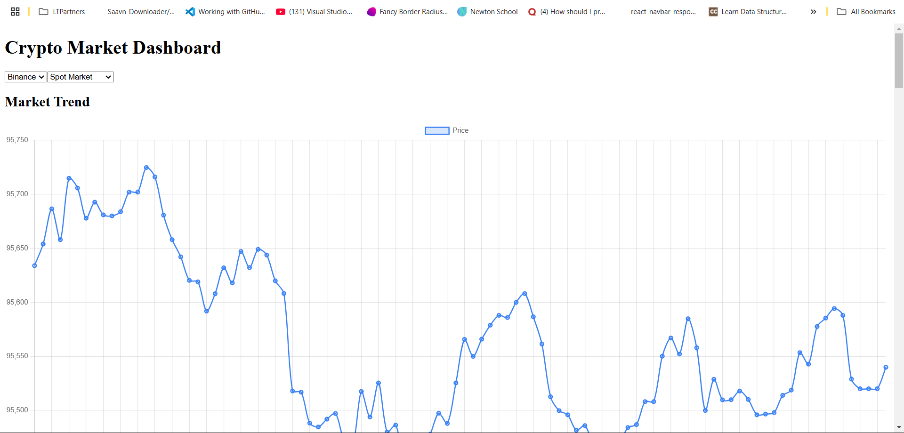
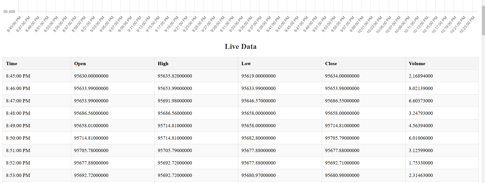
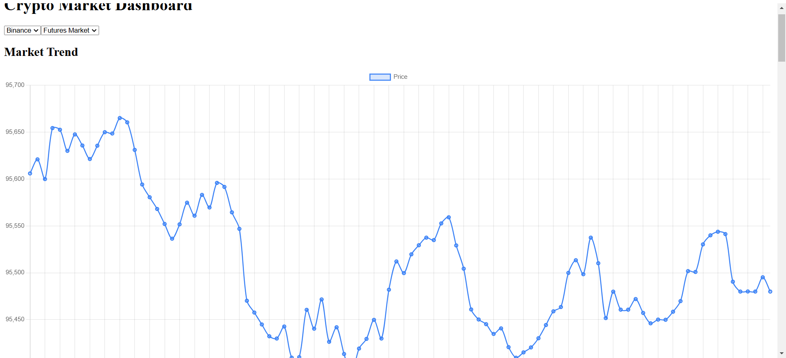

# Crypto Market Dashboard

This project fetches, processes, and displays cryptocurrency market data from multiple exchanges, both historical and real-time. It consists of a backend for data fetching and a frontend for visualization.

## Features

- **Fetch Spot & Futures market data** from Binance, ByBit, MEXC, and KuCoin.
- **REST APIs for historical OHLCV data.**
- **WebSocket servers for live trade data streaming.**
- **Next.js frontend for data visualization.**
- **Interactive dashboard** with exchange and market switching.
- **Live price trend graphs.**
- **Live data table with Open, High, Low, Close, and Volume values.**

## Project Structure

```
crypto-market-dashboard/
│── backend/  # Express.js server
│   ├── controllers/
│   ├── config/
│   ├── server.js
│   ├── package.json
│── frontend/  # Next.js application
│   ├── pages/
│   ├── components/
│   ├── styles/
│   ├── package.json
│── README.md  # Project documentation
```

## Setup Instructions

### 1. Backend Setup

#### Prerequisites:
- Node.js (v16+ recommended)
- NPM or Yarn

#### Installation & Running the Server:
```sh
cd backend
npm install  # or yarn install
npm start  # or node server.js
```

#### API Endpoints:
- **Historical Data (REST APIs):**
  - `GET /api/binance/spot?symbol=BTCUSDT&interval=1m&limit=100`
  - `GET /api/binance/futures?symbol=BTCUSDT&interval=1m&limit=100`
- **Real-Time Data (WebSockets):**
  - Connect to `/ws/spot` for Spot Market data.
  - Connect to `/ws/futures` for Futures Market data.

### 2. Frontend Setup

#### Prerequisites:
- Node.js (v16+ recommended)

#### Installation & Running the Dashboard:
```sh
cd frontend
npm install  # or yarn install
npm run dev
```

Visit `http://localhost:3000` in your browser.

## Output Screenshots

### Dashboard View


### Live Data Table


### Futures Market View


## API Testing with Postman

### Example Request: Fetch Historical Spot Market Data
#### Request:
```
GET http://localhost:5000/api/binance/spot?symbol=BTCUSDT&interval=1m&limit=100
```
#### Response:
```json
{
  "symbol": "BTCUSDT",
  "data": [
    {
      "time": "8:45:00 PM",
      "open": "95630.00000000",
      "high": "95635.82000000",
      "low": "95619.00000000",
      "close": "95634.00000000",
      "volume": "2.16894000"
    },
    {
      "time": "8:46:00 PM",
      "open": "95633.99000000",
      "high": "95653.99000000",
      "low": "95633.99000000",
      "close": "95653.98000000",
      "volume": "8.02139000"
    }
  ]
}
```

---

**Enjoy using the Crypto Market Dashboard! 🚀**

